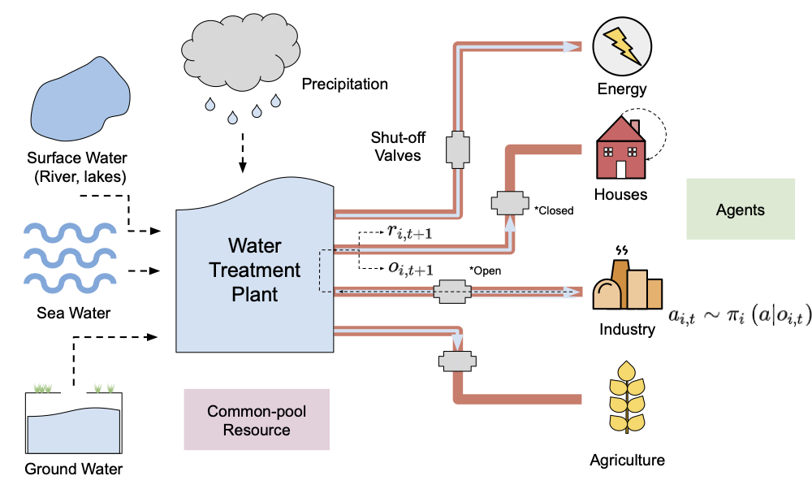
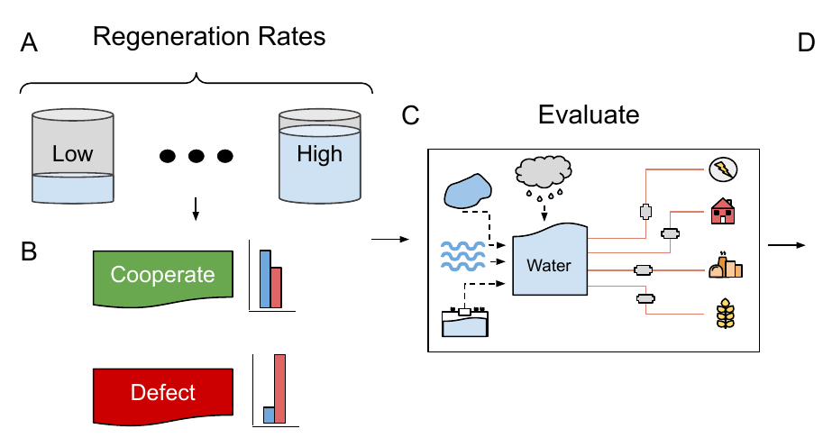
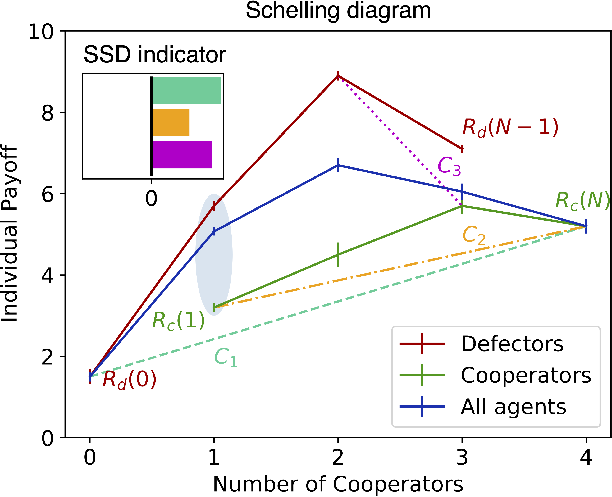
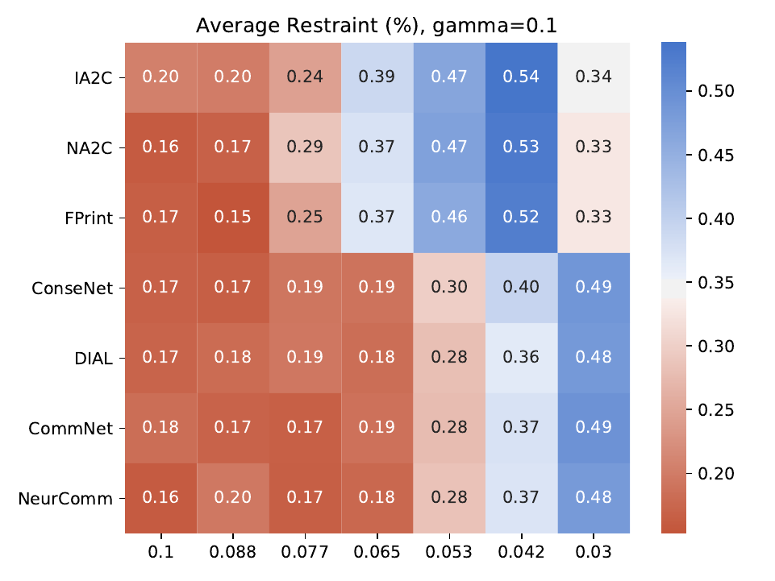

# EGTA of NMARL for CPR <!-- omit in toc -->

## Introduction

This repo contains the code for reproducing the experiments in the paper titled
> A Game-Theoretic Analysis of Networked System Control for Common-Pool
Resource Management Using Multi-Agent Reinforcement Learning.

The code made use of networked multi-agent RL (NMARL) algorithms adapted from
[https://github.com/cts198859/deeprl_network](https://github.com/cts198859/deeprl_network).
The copyright of the above repository belongs to the original authors and we do not
claim ownership of any intellectual property other than that of our original
contributions (see the paper).

Our analysis consists of several steps:
1. Training agents.
2. Evaluating individual agent's restraint.
3. Tagging agents as cooperative/defective.
4. Evaluating the performance of algorithms while varying the ratio of cooperators to defectors.
5. Plotting Schelling diagrams.

___

## Contents <!-- omit in toc -->
- [Introduction](#introduction)
- [Environment](#environment)
- [Algorithms](#algorithms)
- [Building the Docker Images](#building-the-docker-images)
  - [Extra Dependencies](#extra-dependencies)
- [Analysis Pipeline](#analysis-pipeline)
  - [Train Agents](#train-agents)
  - [Evaluate Individual Agent's Restraint and Tag Agents](#evaluate-individual-agents-restraint-and-tag-agents)
  - [Evaluate Performance with Various Numbers of Defectors](#evaluate-performance-with-various-numbers-of-defectors)
  - [Plot Schelling Diagrams](#plot-schelling-diagrams)
  - [Setting the Connected Neighbourhood Reward Weighting Factor](#setting-the-connected-neighbourhood-reward-weighting-factor)
- [Original Networked MARL Code](#original-nmarl-code)

___

## Environment



Our environment is a form of iterated "tragedy of the commons" general sum
Markov game. The environment has a shared resource pool of water from which agents 
acting as valve controllers can extract resources to gain rewards. The initial resource 
value is 0.5 and regenerates over time until depleted.

### Observations <!-- omit in toc -->

Each agent receives, as observations, a tuple
`(current-resource-value, total-taken-by-agent-so-far)`.

### Actions <!-- omit in toc -->

At each time step, agents may choose to `take`, or to `wait`. If They decide
to `wait`, they receive no reward and the resource amount does not diminish. If
instead they decide to `take`, then they diminish the resource by an amount
`0.1/N` where `N` is the total number of agents (4 in our experiments) and
they receive a reward of the same amount. In the context of the paper, the 
actions `take` and `wait` correspond to opening and closing shut-off valves.

### Regeneration <!-- omit in toc -->

At each time step, if the resource is not completely depleted, it regenerates according
to the following formula:
$$
\mathcal{R} \gets \min\{1,\: \mathcal{R} + \Delta_\mathcal{R}\},
$$
where $\Delta_\mathcal{R} \in \left(0, 0.1\right]$ is the regeneration rate.
A regeneration rate of 0.1, would allow agents to take selfishly at every
time step without any chance of the resource depleting.

The game ends when the resource is depleted or after some fixed number of steps.

___

## Algorithms

The following algorithms are trained:
 - **IA2C** (`ia2c_ind` in the code)
 - **NA2C** (`ia2c` in the code)
 - **FPrint** (`ia2c_fp` in the code)
 - **ConseNet** (`ma2c_cu` in the code)
 - **DIAL** (`ma2c_dial` in the code)
 - **CommNet** (`ma2c_ic3` in the code)
 - **NeurComm** (`ma2c_nc` in the code)

___

## Building the Docker Images

There are two docker files in this repo. The first installs tensorflow and
most of the dependencies used by the code. The second installs
[hydra](https://hydra.cc/) and joblib for configuration and parallel
processing. The images can be built simply by running
```
make build
```
The program can then mostly be run and managed via make.

### Extra Dependencies

We use docker to run and manage the code and experiments; however, some
additional dependencies are required:
 - `docker` should be installed on the base system
 - `make` is used to run basic commands
 - `tmux` is used to launch some processes (such as tensorboard) in the background

___

## Analysis Pipeline




### Train Agents

Agents are trained for various levels of resource regeneration, with
different initial seeds. Agents can be trained by executing the following
command:
```
make regen_exp
```
This command executes the script [regen_exp.sh](regen_exp.sh) which starts up
a docker container and runs the main training program
[regen_exp.py](egta/regen_exp/regen_exp.py) which uses hydra joblib
sweeper to launch many training runs in parallel. Specifically, this trains
agents for every combination of the following parameters:
```bash
seeds="0,1,2"
algorithms="ia2c,ia2c_fp,ia2c_ind,ma2c_cu,ma2c_ic3,ma2c_dial,ma2c_nc"
regen_rates="0.03,0.042,0.053,0.065,0.077,0.088,0.1"
```
The number of parallel processes used for training can be set via the
`num_threads` field in
[config.yaml](egta/regen_exp/conf/config.yaml)
The saved models and many individual evaluation episodes are stored in the
`results/` directory.

Executing following command will process the evaluation episodes data:
```
make process_evaluation_data
```
The processed evaluation data is saved as a pickle file (`results/regen_exp/tragedy/evaluation_results_data.p`)

### Evaluate Individual Agent's Restraint and Tag Agents
Using the processed evaluation data, the agent's average restraint percentage can be computed. Which is averaged across the seeds and the episodes. Then the restraint heat-map can be plot by the following command:
```
make plot_restraint_heat_map
```


### Evaluate Performance with Various Numbers of Defectors
The agents need to be categorized as defectors or cooperators based on their average restraint percentage and the classification thresholds. The threshold can be adjusted in the `experiments/classify_agent_behaviour.py` file.
The following command will categorized the agents and save the classification to the `agent_tags.p` file:
```
make classify_agent_behaviour
```

Once agents are categorized, they can be played against each other. The
file `agent_tags.p` in the directory `results/regen_exp/tragedy/`, running the following
command will generate a sequence of evaluation runs with varying number of
defector agents.
```
make play_defect
```
This command runs the shell script [play_defectors.sh](play_defectors.sh)
which launches many parallel evaluation runs for each algorithm. The results
of these runs are stored under
`results/regen_exp/<alg>/defectors=<defectors>/`.

This data can be processed by the following command:
```
make process_interaction_data
```

### Plot Schelling Diagrams
Using the processed data, a Schelling diagram can be plot for each algorithm by the following command:
```
make plot_schelling_diagrams
```


### Setting the Connected Neighbourhood Reward Weighting Factor

In our paper, we discuss a connected neighbourhood reward weighting factor $\alpha$. In the code this
is referred to as `coop_gamma`, as it was in the original NMARL code. This
parameter affects the level of cooperation between agents by sharing rewards.
The reward seen by each agent at each time step is the weighted combination
of its own reward with those of its neighbors, calculated as follows:
$$
r_{coop} = r_i + \sum_{j\in\mathcal{N}_i} \alpha \, r_j,
$$
where $\mathcal{N}_i$ is the adjacency list of agent $i$ in the communication
graph. Negative values of $\alpha$ are equivalent to $\alpha = 1$. Since
$\alpha$ affects the magnitude of the rewards seen by each agent, reward
normalization need to be set independently for each value of $\alpha$. The
normalization should be set so that each agent typically sees a reward of
order 1. This translates to the following:

| $\alpha$ | `reward_norm` |
| :------: | :-----------: |
|    0     |     0.025     |
|   0.1    |    0.0325     |
|    1     |      0.1      |

The value of $\alpha$ can be set in
[config.yaml](egta/regen_exp/conf/config.yaml) under the name
`coop_gamma`, and `reward_norm` can be set in each of the config files found in
[egta/config/](egta/config/)

___

## Original NMARL Code
See the paper:
> [Multi-agent Reinforcement Learning for Networked System
Control](https://openreview.net/forum?id=Syx7A3NFvH)

and the github repo:
[https://github.com/cts198859/deeprl_network](https://github.com/cts198859/deeprl_network)
for the original NMARL code and more information about the algorithms used.
